```mermaid
graph TD
    A[Task Classifier Agent] -->|Handoffs| B[Building Agent]
    A -->|Handoffs| C[Squad Formation Agent]
    A -->|Handoffs| D[Squad Commander Agent]
    A -->|Handoffs| E[Default Executor Agent]
    D -->|Handoffs| C
    T11 -->|Activate| F[Squad Command Expert]
    T17 -->|Activate| F[Squad Command Expert]

    subgraph Building Agent Tools
        B --> T1[build_unit]
        B --> T2[place_building]
        B --> T3[produce_units]
        B --> T4[deploy_mcv]
        B --> T5[manage_production]
        B --> T6[repair_units]
        B --> T7[query_game_state]
    end

    subgraph Squad Formation Agent Tools
        C --> T8[form_group]
        C --> T9[query_group]
        C --> T10[query_game_state]
    end

    subgraph Squad Commander Agent Tools
        D --> T11[squad_commander_tool]
        D --> T12[attack_target]
        D --> T13[move_squad_by_location]
        D --> T14[stop_move_squad]
        D --> T15[query_group]
        D --> T16[squad_attack_enemy_actor]
        D --> T17[explore_map]
        D --> T18[query_game_state]
    end

    subgraph Default Executor Agent Tools
        E --> T19[build_unit]
        E --> T20[place_building]
        E --> T21[produce_units]
        E --> T22[deploy_mcv]
        E --> T23[manage_production]
        E --> T24[repair_units]
        E --> T25[query_game_state]
        E --> T26[move_units_by_location]
        E --> T27[form_group]
        E --> T28[query_group]
        E --> T29[stop_move]
        E --> T30[attack_target]
    end

    subgraph Squad Command Expert Tools
        F --> T31["squad_commander_tool\n(Attack, Defense, Retreat)"]
        F --> T32["explore_map\n(Explore)"]
    end
```

# Red Alert AI Copilot

一个基于大语言模型的《红色警戒》智能指挥助手，基于OpenAI-Agents框架开发，能够通过自然语言或语音指令控制游戏中的建造、部队编队和战斗指挥。参加第一届[红警hackathon](https://hackathon.mofa.ai/)，工作党实在懒得刷分，止步初赛第九。


## 🚀 快速开始

### 1. 环境准备

**系统要求**
- Python 3.9+
- MiniConda
- OpenRA 游戏已安装并运行（可直接下载比赛官方release版本 https://github.com/OpenCodeAlert/Hackathon2025/releases/tag/v1.3.2） 

**克隆项目**
```
git clone https://github.com/gongpx20069/OpenRACopilot.git
```

**创建虚拟环境（推荐）**

```
conda create -n redalert python=3.11
conda activate redalert
```

**安装依赖**

```
pip install -r requirements.txt
```

### 2. 配置项目
#### 2.1 获取API密钥
**必需配置：**

1. Azure OpenAI 服务
    - 访问 Azure Portal
    - 创建 Azure OpenAI 资源
    - 获取 API Key 和 Endpoint
2. Azure 语音服务
    - 访问 Azure Portal
    - 创建语音服务资源
    - 获取语音服务密钥和区域信息
#### 2.2 修改配置文件
编辑`configs.py`文件，替换以下配置：

```python
# Azure OpenAI 配置
class AOAI_CONFIGS:
    AOAI_APIKEY = "你的Azure OpenAI API密钥"
    AOAI_ENDPOINT = "你的Azure OpenAI Endpoint"
    AOAI_DEPLOYMENT = "gpt-4.1"  # 或你部署的模型名称
    AOAI_API_VERSION = "2025-01-01-preview"

# Azure 语音服务配置
class AZURE_SPEECH_CONFIGS:
    AZURE_SPEECH_KEY = "你的Azure语音服务密钥"
    AZURE_SPEECH_REGION = "eastus"  # 或你的服务区域
    AZURE_SPEECH_ENDPOINT = "https://你的区域.api.cognitive.microsoft.com/"

```

### 3. 运行项目

#### 3.1 基础运行

**文本输入模式：**

```bash
python run_agents.py
```

**语音输入模式：**

```bash
python run_agents.py --enable_speech true
```

#### 3.2 高级运行选项

```bash
# 查看帮助信息
python run_agents.py --help


```

#### 3.3 测试运行
运行测试脚本验证环境：

```bash
python -m pytest tests/
```

## 🎯 使用示例

**建造相关：**

- "建造一个发电厂"
- "生产5个超重坦克"
- "在建造厂右侧建造兵营"

**部队指挥：**

- "小队1向地图左上角探索，小队2向地图左下角探索，遇到敌人立刻攻击"
- "小队2移动到我方建造厂右侧"
- "所有小队撤回我方建造厂附近"

**编队管理：**

- "把基地附近的5个超重坦克编成2号小队"
- "将所有士兵和火箭军编队为队1，所有防空车编队为队2，所有超重坦克编队为队3"

**复杂指令链**

- "先建造一个发电厂，然后建造兵营，接着生产10个步兵，最后让他们去探索地图右侧"
- "组建一个攻击小队，包含5辆坦克和3辆火箭车，然后探索地图，遇到敌人立刻攻击"

## 📁 项目结构

```
plainText
redalert-hackathon/code-alert-ai-agent/
├── OpenRA_Copilot_Library/          # OpenRA游戏API接口库
│   ├── __init__.py
│   ├── openra_copilot_library.py    # 主游戏接口
│   └── ...
├── azure_speech/                    # Azure语音转文本功能
│   ├── __init__.py
│   └── speech_to_text.py
├── llm_core/                        # 核心代码目录
│   ├── agent/                       # Agent相关代码
│   │   ├── orchestrater.py         # 智能体协调器
│   │   ├── agent_factory.py        # 智能体工厂
│   │   └── utils.py                # 工具函数
│   ├── expert/                      # 专家系统
│   ├── monitor/                     # 监控模块
│   ├── tools/                       # 工具函数
│   └── runtime_game_state.py       # 运行时游戏状态
├── documents/                       # 项目文档
│   ├── agentflow.mermaid           # Agent流程图
│   ├── mission.txt               # 任务描述
│   └── openra_copilot_library.md  # 游戏库说明
├── configs.py                     # 项目配置文件
├── requirements.txt               # 项目依赖
├── run_agents.py                  # 主入口文件
├── run_mcp_clients.py            # MCP客户端运行脚本
├── run_mcp_servers.py            # MCP服务器运行脚本
└── tests/                         # 测试代码
```

### 核心模块说明

#### 1. 智能体系统 (llm_core/agent/)
智能体系统是项目的核心，负责处理用户指令、进行任务分类并分配给专业智能体执行。

**主要组件：**

- orchestrater.py: 智能体协调器，管理多智能体工作流
- agent_factory.py: 智能体工厂，负责创建各类智能体
- utils.py: 工具函数，包含任务分类等功能

#### 2. 专家系统 (llm_core/expert/)

专家系统包含特定领域的专业知识和决策逻辑。

**Squad Command Expert**

主要位于`llm_core/expert/group_command_expert.py`，负责高效处理小队高级指令，分为四种作战模式：**攻击模式（Attack），防御模式（Defense），撤退模式（Retreat）和探路模式（Scout）**。

*🎯 攻击模式 (Attack)*
- 核心目标: 全面进攻，消灭所有敌方力量
- 攻击优先级: 防御塔 → 战斗单位 → 非战斗单位 → 建筑
- 使用场景: 主动进攻、推进战线、清剿敌军

*🛡️ 防御模式 (Defense)*
- 核心目标: 清理威胁，保护己方单位
- 攻击优先级: 防御塔 → 战斗单位 → 非战斗单位（不攻击建筑）
- 使用场景: 基地防守、遭遇战、保护重要单位

*🏃 撤退模式 (Retreat)*
- 核心目标: 有序撤离到安全位置
- 撤退路径: 用户指定位置 → 己方建造厂 → 己方建筑中心
- 使用场景: 兵力劣势、保存实力、战略转移

*🔍 探路模式 (Scout)*
- 核心目标: 智能探索地图，遇敌自动应对
- 行动策略: 分组编队移动 → 保持5格间距 → 遇敌切换预设战斗模式
- 使用场景: 地图探索、敌情侦查、战略侦察

*🔍 探路模式 (Scout)*
- 核心目标: 智能探索地图，遇敌自动应对
- 行动策略: 分组编队移动 → 保持5格间距 → 遇敌切换预设战斗模式
- 使用场景: 地图探索、敌情侦查、战略侦察

这几种模式由**Squad Command Agent**负责调用。

**Task Classifier Function**

使用传统的NLP模式匹配算法代替**Task Classifier Agent**，提高指令解析效率（可以直接关闭）。

#### 3. 工具集 (llm_core/tools/)

**主要组件：**

- function_tools.py: 功能工具集，如建造、移动、攻击等
- mcp_tools.py: MCP协议相关工具

**NOTE: mcp_tools.py中的MCP Tools由于三方tools的效率较低，因此弃用，改为直接调用function_tools.py中的Agent Tools**

#### 4. 游戏接口 (OpenRA_Copilot_Library/)
**主要组件：**

- openra_copilot_library.py: 主游戏接口，负责与OpenRA游戏引擎交互

#### 5. 智能体类型及职责
项目采用分层多智能体协作架构，通过任务分类和智能体间的协作完成复杂的游戏控制任务。


- 🤖 **Task Classifier Agent - 任务分发官**：智能解析用户指令，将任务精准分配给最合适的专业Agent，智能路由，也可切换为传统的关键词识别、任务分类。
- 🏗️ **Building Agent - 建筑大师**：统筹基地建设和资源发展，智能规划建筑布局，管理生产队列，优化资源利用。
- 👥 **Squad Formation Agent - 部队编组专家**：智能化军事单位编组和管理，根据单位类型自动创建最优战斗小组，保持队形和战术。
- ⚔️ **Squad Commander Agent - 战场指挥官**：实时战术指挥和战斗决策，根据情况切换不同的作战模式，确保战斗效率和效果。
- 🔍 **Default Red Alert Agent - 默认通用复杂任务指挥官**：当其他Agent无法解决当前任务时，或者Task Classifier发现是通用任务时，则hand off给本Agent。可用于解决所有任务，但由于tools编排过多，简单任务也会使用复杂流程（multi-turn）完成。

## 🤝 贡献指南

**Fork 项目**

- 创建功能分支 (git checkout -b feature/AmazingFeature)
- 提交更改 (git commit -m 'Add some AmazingFeature')
- 推送到分支 (git push origin feature/AmazingFeature)
- 开启 Pull Request

## 📄 许可证

本项目采用 MIT 许可证 - 查看 LICENSE 文件了解详情。

## 📞 支持

遇到问题或有建议？请提交 Issue